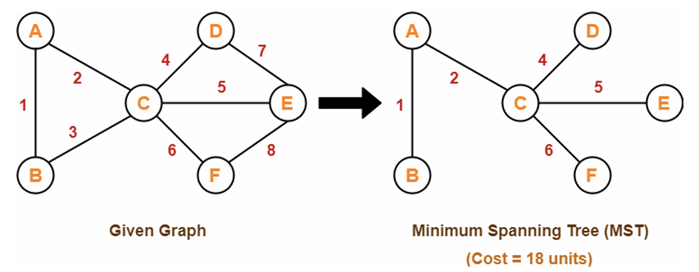
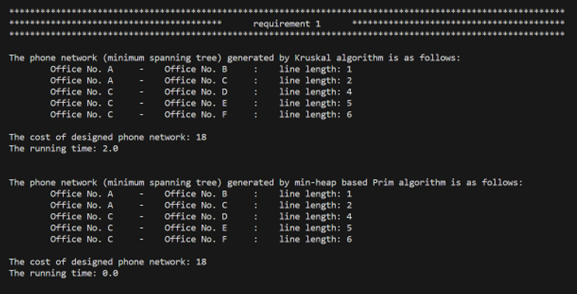
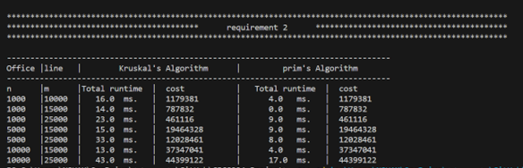
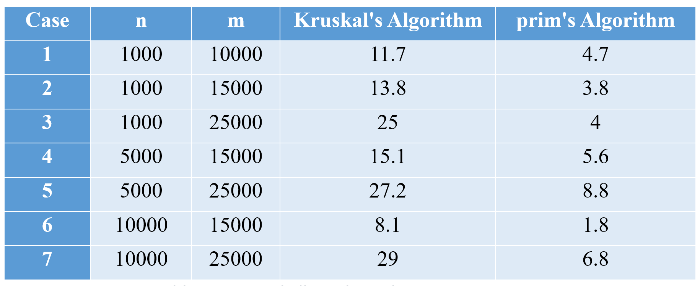
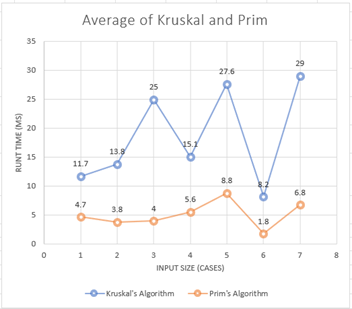

# 📡 Phone Network Design using MST Algorithms

## 🚀 Project Overview
This project focuses on designing a **Phone Network System** using **Minimum Spanning Tree (MST) algorithms**. The aim is to efficiently connect multiple office locations with **minimum cost** while ensuring full connectivity. The project was developed as part of the **CPCS 324: Algorithms and Data Structures II** course.

## 🎯 Key Features
- ✅ **Graph Representation:** Reads graph data from a file and represents it as an adjacency list.
- ✅ **Random Graph Generation:** Generates graphs with different sizes and edge densities for performance analysis.
- ✅ **Minimum Spanning Tree (MST) Computation:** Implements two MST algorithms:
  - **Kruskal's Algorithm** (Union-Find based implementation)
  - **Min-Heap Based Prim's Algorithm**
- ✅ **Performance Analysis:** Compares the execution time of Kruskal and Prim algorithms for large datasets.
- ✅ **Results Printing:** Prints the computed MST and total cost for both algorithms.

## 🛠️ Tech Stack
- **Programming Language:** Java

## 📌 Input & Output Graphs
<p align="center">  </p>

## 📌 System Components
### 📜 Graph Representation
The project defines a **Graph Framework** consisting of:
- **Graph Class:** Represents the graph with vertices and edges.
- **Vertex Class:** Defines properties of graph nodes.
- **Edge Class:** Defines connections between vertices with weights.

### 📊 MST Algorithms Implementation
#### 1️⃣ Kruskal’s Algorithm
- Uses **Disjoint Set Union (DSU)** to avoid cycles.
- Sorts edges in ascending order and selects edges greedily.
- Outputs the MST and its cost.

#### 2️⃣ Min-Heap Based Prim’s Algorithm
- Uses a **Min-Heap (Priority Queue)** to find the minimum edge efficiently.
- Expands MST by always selecting the lowest cost edge.
- Outputs the MST and its cost.

## 📷 Screenshots of Output
### Requirement 1: MST Computation from File Input
- Kruskal and Prim algorithms generate the MST from a predefined graph.
- Example Output:
<p align="center">  </p>


### Requirement 2: Random Graph Performance Comparison
- Graphs are generated and tested with both algorithms.
- Execution times are printed for different input sizes.
- Example Output:
<p align="center">  </p>


## 📈 Experimental Analysis
### 🔬 Graph Generation
A function `makeGraph(n, m)` generates random graphs for:
- `n=1000` with `m=10000, 15000, 25000`
- `n=5000` with `m=15000, 25000`
- `n=10000` with `m=15000, 25000`

### 📊 Performance Comparison
- **Execution Time Measurement:** Runs both algorithms on generated graphs.
  - Kruskal's and Prim's Average Runtimes:
    <p align="center">  </p>
- **Graph Plotting:** Compares performance using **time complexity analysis**.
  - Kruskal's and Prim's Average Runtimes Plot:
    <p align="center">  </p>


## 🚀 Getting Started
### 🔧 Installation & Setup
1️⃣ **Clone the repository:**
   ```sh
   git clone https://github.com/your-username/phone-network-mst.git
   ```
2️⃣ **Open the project in your preferred Java IDE.**
3️⃣ **Run the main program `PhoneNWDesignApp.java`.**

## 🔍 Usage Guide
- 📂 **Read Graph from File:** Ensure the input file format follows the required structure.
- 🔢 **Generate Random Graphs:** Modify `makeGraph()` parameters for custom testing.
- ⏱️ **Analyze Performance:** Run the program with large graphs to compare algorithm efficiency.

## 🔥 Conclusion
This project demonstrates the practical application of **graph algorithms** in network design. Through **Kruskal’s and Prim’s algorithms**, we explored different approaches to computing the **Minimum Spanning Tree**, highlighting their advantages and performance differences.

## 📌 References
- "Introduction to The Design and Analysis of Algorithms" - Anany Levitin

---
📌 **Developed for CPCS 324: Algorithms and Data Structures II**

